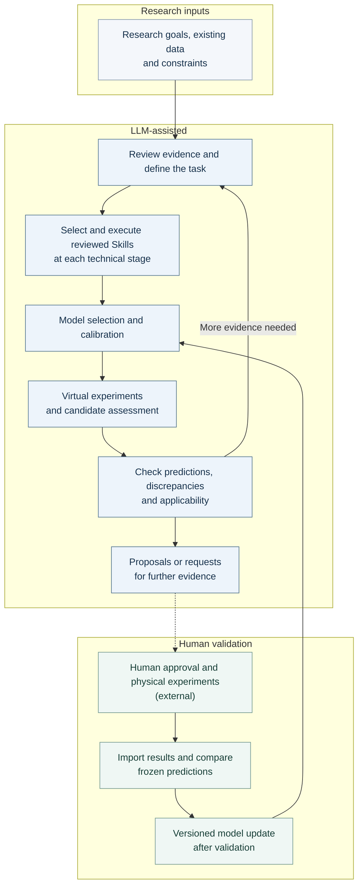

# Axiom Research

[English](README.md) · [简体中文](README.zh-CN.md)

**A modular LLM-assisted research framework connecting scientific evidence, numerical modelling and experimental feedback through reusable Skills.**

Start with a research question, the available data and practical constraints. A file- and terminal-capable LLM host organises evidence and selects reviewed Skills; numerical tools perform the calculations. Researchers receive traceable analyses and proposals, then decide which physical experiments to perform and which results to return.

The workflow can support materials-design and process-improvement studies. Its modular interfaces are extensible; the models currently implemented remain specific to their documented materials, observables and process conditions.

[Research workflow](#research-workflow) · [Quick start](START_HERE.md) · [Package guide](PACKAGE_GUIDE.md) · [Host guide](HOST_START.md) · [Static overview](index.html)

## Research workflow

This is the overall research workflow, **not a claim that every module automatically implements the whole loop**. See the [capability status](#capability-status-and-boundaries) below.

<!-- workflow:en:start -->

<!-- workflow:en:end -->

[View the local SVG](docs/assets/research-workflow.svg) · [Editable Mermaid source](docs/assets/research-workflow.mmd)

The host selects a suitable reviewed Skill **at each technical stage**; the selection node does not mean “once per research round”. Numerical results come from checked programs, while manufacturing and testing take place outside the framework under researcher control. Insufficient data or model support leads to additional evidence, calibration or a stop—not a claimed optimum. Feedback updates require the validation supported by the chosen module.

## Capability groups

| Research need | Skills and tools |
| --- | --- |
| Define the question and review evidence | Source-located evidence, assumptions and gaps: [evidence Skill](skills/hybrid-am-evidence/SKILL.md) |
| Calibrate a model | Measured-response fitting and grouped validation: [calibration Skill](skills/measured-response-calibration/SKILL.md) |
| Run computational experiments and assess candidates | Lightweight [diffusion calculations](skills/diffusion-moments/SKILL.md), [foam model comparison](skills/polymer-foam-model-refinement/SKILL.md) and supported-domain candidate assessment |
| Analyse discrepancies and possible causes | Evidence-linked hypotheses and distinguishing checks: [cause-analysis Skill](skills/hybrid-am-cause-analysis/SKILL.md) |
| Propose experiments or further measurements | Budgeted, constrained [candidate planning](skills/bounded-experiment-planning/SKILL.md) or [calibration planning](skills/calibration-only-planning/SKILL.md), within the implemented VPP–DIW workflow |
| Compare feedback and update models | [Frozen-prediction comparisons](skills/descriptive-feedback/SKILL.md) and [versioned updates with fresh confirmation](skills/safe-model-update/SKILL.md), within the VPP–DIW runtime |

## Current examples

| Example | What it demonstrates | Start here |
| --- | --- | --- |
| VPP–DIW track width / diffusion | Separate empirical geometric-width and concentration-sigma routes; calibration, bounded proposals, measured-feedback comparison and guarded model updates | [Width fixture](examples/width-calibration-demo/README.md), [sigma fixture](examples/sigma-calibration-demo/README.md), [workflow and run records](LEGACY_VPP_DIW.md) |
| Hierarchical polymer foams | Two-level lightweight modelling, calibration, predeclared refinements and limited supported-domain sensitivity analysis | [Module guide](skills/polymer-foam-model-refinement/SKILL.md), [synthetic fixture](examples/foam-refinement-demo/README.md), [research templates](templates/foam-research/task.json) |

These are implemented application examples, not a definition of all possible research uses. Bundled numerical fixtures are synthetic software demonstrations. The foam module has its own entry point; the VPP–DIW multi-round runtime does not automatically apply to it.

## What goes in / What comes out

| Research inputs | Inspectable outputs |
| --- | --- |
| Question, observable, objectives and constraints | Explicit task scope, assumptions and missing-data requests |
| Literature and source locations | Evidence records with conditions and traceable references |
| Measurements, units, sample identities and declared partitions | Calibration diagnostics, numerical analyses and model comparisons |
| Parameter bounds, budget and external experimental feedback | Module-supported candidate suggestions, frozen-prediction comparisons and versioned reports |

Files and numerical outputs depend on the selected module. A suggestion is a research proposal for human review, not an equipment command.

## Choose an entry point

- **Understand the project:** read this overview, the [workflow SVG](docs/assets/research-workflow.svg) and the [package map](PACKAGE_GUIDE.md).
- **Run local tools:** follow [START_HERE.md](START_HERE.md) for either application example. These scripts do not automatically connect to an LLM.
- **Use an LLM host:** read [HOST_START.md](HOST_START.md) and the main [Skill](SKILL.md). The host must support files and terminal tools.

Get the **v1.1.3 documentation release**: [complete ZIP](https://github.com/yuerway983-create/axiom-research-skill/releases/download/v1.1.3/axiom-research-modeling-toolkit-v1.1.3.zip), [checksums and release](https://github.com/yuerway983-create/axiom-research-skill/releases/tag/v1.1.3), or [included release notes](docs/RELEASE_DRAFT.md). The previous [v1.1.2 release](https://github.com/yuerway983-create/axiom-research-skill/releases/tag/v1.1.2) remains available with its original documentation.

## Capability status and boundaries

| Area | Current status | Implementation evidence |
| --- | --- | --- |
| VPP–DIW workflow | Executable numerical tools, host-directed operation and guarded multi-round feedback; fixed demos remain deterministic and synthetic | [Runtime](scripts/agent_runtime.py), [round tools](scripts/round_tools.py), [demo](scripts/campaign_demo.py) |
| Foam modelling | Executable independent analysis; no integrated automatic experiment planner or validated end-to-end process-to-performance chain | [Numerical entry](scripts/foam_model.py), [module workflow](skills/polymer-foam-model-refinement/references/workflow.md) |
| Cause analysis | Host-read supplementary analysis; not automatically consumed by the planner or included in formal runtime audit/reporting | [Integration contract](skills/hybrid-am-cause-analysis/references/integration.md) |
| Skill and literature discovery | Local registry contains reviewed entries; fresh literature or GitHub discovery requires authorised host tools and review before integration | [Registry](registry/runtime-skills.json), [host instructions](HOST_START.md) |
| Broader research applications | Extension opportunities requiring suitable data, models and adapters; not implemented universal materials design | [Current scope](SKILL.md) |

Prediction intervals, Bayesian optimisation, commercial solver integration and equipment control are not implemented features. Synthetic demos do not establish autonomous LLM research, real-material improvement or superiority over ordinary modelling. Detailed module-specific constraints stay in the linked technical guides.

## Sources, reproducibility and licence

The master Skill is `axiom-research`; the repository remains `axiom-research-skill`. Distribution **1.1.3** is separate from VPP–DIW runtime **1.0.0**, cause analysis **0.2.0** and foam **foam-0.1**. This revision changes documentation and presentation only.

Source records and methods remain in [evidence/](evidence/) and [references/](references/); foam-specific sources are [listed in the module](skills/polymer-foam-model-refinement/references/sources.md). [Tests](tests/) and [historical reports](reports/) record software checks, not universal scientific validation. [VERSION](VERSION) and [MANIFEST.json](MANIFEST.json) identify and check the package; each historical manifest belongs only to its original version.

Project-owned files use the [MIT licence](LICENSE). Retain the [third-party notices](THIRD_PARTY_NOTICES.md) and component-specific attribution.
