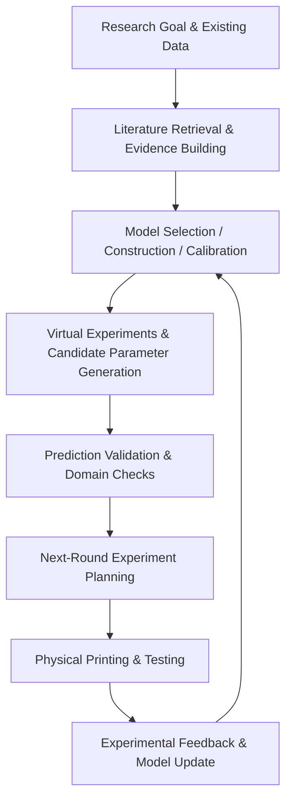

# Hybrid-AM Research Skill · v1.0

An evidence-grounded research agent for hybrid additive manufacturing.
It coordinates literature retrieval, lightweight virtual experiments, model calibration,
experiment planning, and iterative feedback through dynamically selected scientific skills.
## Research Workflow

> At each technical stage, the master research skill selects and invokes suitable reviewed sub-skills from the scientific open-source ecosystem.
## Current Status
**v1.0 research-agent prototype**
The complete software workflow can be demonstrated without real printing data using clearly labelled synthetic datasets.
Real additive-manufacturing experiments are still required to validate actual process improvement and material performance.
## Start here

- [`START_HERE.md`](START_HERE.md) — local demonstration and setup
- [`HOST_START.md`](HOST_START.md) — agent-controlled workflow
- [`SKILL.md`](SKILL.md) — master skill definition
- [`reports/`](reports/) — demonstration and validation records
## Completed software scope

- 14 allowlisted tools with per-stage reviewed-skill selection and instructions loading.
- Checked task/provenance/units; technical-repeat aggregation; group-separated validation.
- Two different routes: concentration-profile sigma and empirical geometric track width.
- Bounded parameter screening and calibration-only fallback when evidence/model gates fail.
- Operator-attached actual-setting logs and measured-response records; frozen prediction scoring
  and descriptive concurrent-baseline comparison before using new data for fitting.
- New versioned fit datasets; old holdout retired; separate frozen updated model.
- Prospective fresh-confirmation plan and operator import, then unchanged acceptance and
  non-degradation checks. Failed/missing checks route to calibration-only, not fabricated predictions.
- Automatic child-round creation, inherited accepted model, next-round proposals and a bounded
  round budget. No previous raw data/model/result is overwritten.
- Host-driven CLI interface; optional Responses loop automatically switches to created child sessions.
- Separate synthetic environment for repeatable normal and failure-case SOFTWARE tests.

## What each run means

| Execution | Meaning |
|---|---|
| `campaign_demo.py` | Deterministic, synthetic software acceptance test, no LLM decisions |
| Host + `agent_bridge.py` | Real individual numerical tool calls selected by the host LLM |
| `llm_agent.py` | Opt-in remote Responses driver; contract-tested, not live-account-tested here |
| Imported measured data | Operator-declared laboratory records; software does not certify authenticity |

Live GitHub/literature discovery uses the host's authorised tools. The local registry is not a
web search. New external code needs review/registration; no automatic arbitrary installation.
No COMSOL/Abaqus/DEFORM or printer APIs are invoked. No confidence/prediction intervals,
formal sequential significance tests or automatically determined sample sizes are claimed.
Image metrology, new material physics and full multi-objective BO are outside this release's scope.

## Data protection and reproducibility

Input snapshots and numerical artifacts are hash-checked. Calls have unique identifiers and
are replayable/idempotent. Each round has a separate directory and lineage. The audit detects
local inconsistency but is not an external signature. Untrusted repositories must be reviewed;
the CLI is not a general-purpose OS sandbox. No keys, private data or binaries are bundled.

## Attribution and publication

See THIRD_PARTY_NOTICES.md and registry/reviews/. Upstream workflows were reviewed; actual
Python adapters are project implementations using separately installed libraries. Public
repository visibility and the licence for project-owned files remain an owner decision.
The folder is ready to inspect or put in a private repository; no remote repository was created.

Historical v0.2–v0.4 reports are preserved as archives. Start NEW v1.0 sessions; do not resume
old-version sessions against changed code hashes. Legacy input schemas (0.3/0.4) remain supported
intentionally, so numeric task/feedback examples do not require relabelling.
