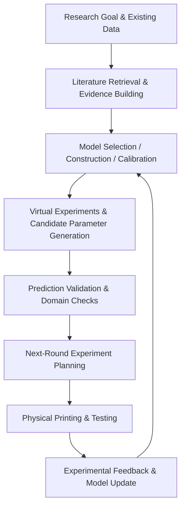

# Axiom Research

科研智能建模与实验优化框架：连接科学知识、轻量模型与实验反馈的 LLM 辅助科研工作流。

Skill 调用名：`axiom-research`；界面展示名：**Axiom Research**。原名 Hybrid-AM Research，现有仓库网址保留以兼容旧链接。
当前实现仍聚焦混合 VPP–DIW 增材制造与发泡 FDM 分级聚合物泡沫，通用品牌名不代表已支持所有材料或科研领域。
原 v1.0 工作流、原因分析 v0.2 和 foam-0.1 模块的版本与验证边界保持不变。
## Research Workflow

> At each technical stage, the master research skill selects and invokes suitable reviewed sub-skills from the scientific open-source ecosystem.
## Current Status
**v1.0 research-agent prototype**
The complete software workflow can be demonstrated without real printing data using clearly labelled synthetic datasets.
Real additive-manufacturing experiments are still required to validate actual process improvement and material performance.
## Start here

- [`START_HERE.md`](START_HERE.md) — local demonstration and setup
- [`HOST_START.md`](HOST_START.md) — agent-controlled workflow
- [`SKILL.md`](SKILL.md) — master skill definition
- [`skills/hybrid-am-cause-analysis/SKILL.md`](skills/hybrid-am-cause-analysis/SKILL.md) — LLM cause analysis and parameter advice (v0.2, host-read supplement)
- [`skills/polymer-foam-model-refinement/SKILL.md`](skills/polymer-foam-model-refinement/SKILL.md) — 发泡 FDM 分级聚合物泡沫的独立简化计算与候选模型修正（foam-0.1）
- [`reports/`](reports/) — demonstration and validation records
## Completed software scope

- 14 allowlisted tools with per-stage reviewed-skill selection and instructions loading.
- Checked task/provenance/units; technical-repeat aggregation; group-separated validation.
- Two different routes: concentration-profile sigma and empirical geometric track width.
- Bounded parameter screening and calibration-only fallback when evidence/model gates fail.
- Operator-attached actual-setting logs and measured-response records; frozen prediction scoring
  and descriptive concurrent-baseline comparison before using new data for fitting.
- New versioned fit datasets; old holdout retired; separate frozen updated model.
- Prospective fresh-confirmation plan and operator import, then unchanged acceptance and
  non-degradation checks. Failed/missing checks route to calibration-only, not fabricated predictions.
- Automatic child-round creation, inherited accepted model, next-round proposals and a bounded
  round budget. No previous raw data/model/result is overwritten.
- Host-driven CLI interface; optional Responses loop automatically switches to created child sessions.
- Separate synthetic environment for repeatable normal and failure-case SOFTWARE tests.

## LLM 原因分析与参数建议 · 子 Skill v0.2

新增的 [hybrid-am-cause-analysis](skills/hybrid-am-cause-analysis/SKILL.md) 将现象、证据、候选原因和区分检查连接起来，给出符合目标与预算的下一步建议。
它区分方向建议、诊断试验和有数值模型依据的目标候选；缺少模型仍可排查原因，缺少试验名额时继续核查已有记录。

文件型 LLM 宿主可在标定后、规划前，或冻结模型比较后、更新前读取该 Skill。
具体调用提示见 [HOST_START.md](HOST_START.md#llm-原因分析与参数建议宿主补充步骤)，输入、预算、结构化输出和自动接入设计见 [接入说明](skills/hybrid-am-cause-analysis/references/integration.md)。
当前以宿主补充分析方式使用：自动运行时仍为 v1.0 的 14 个工具，规划器尚不接收诊断候选，也不会自动将分析写入正式报告或审计。
子 Skill 的格式、结构约束和合成案例行为已检查；真实工艺效果仍需实验评价。

## 发泡 FDM：因素提取、简化计算与模型修正 · foam-0.1

围绕 Reece Oosterbeek 团队的两级孔结构研究，增加独立宿主 Skill 与 `scripts/foam_model.py`。原论文已有两级简化模型；本扩展在其基础上加入数据核对、标定、有限修正与验证，不声称首次替代原文的完整仿真。

- 按总相对密度和微观孔隙占全部孔隙的份额，计算微／宏两级密度。
- 分别标定单尺度幂律，预测小应变压缩模量或初始压缩屈服强度。
- 独立标定温度／出料倍率到内部密度的经验响应面；这不是发泡过程物理仿真，也尚未验证完整工艺到性能预测链。
- 比较原始模型、普通密度残差修正及最多两项预声明的宿主修正；只用训练条件 CV 选模型，冻结后再评分留出集。
- 合并技术重复、按条件等权、阻止样品／条件／批次跨分区；报告训练范围内的敏感性、输入快照、哈希和适用边界。

LLM 宿主负责有出处的因素提取、候选机制与中文解释；程序负责可复算的数值。脚本不自行调用 LLM API，也不自动生成真实数据、执行打印或调用商业仿真软件。该模块未注册到旧 14 工具运行时，原 VPP–DIW 流程不变。独立调用仍需保留完整仓库目录，不是只复制子 Skill 文件夹即可运行。

使用已有 `requirements-calibration.txt` 中的 NumPy/SciPy，或只安装 `requirements-foam.txt`。Windows 可从仓库根目录创建隔离环境（已有环境可跳过第一行），优先使用国内镜像：

```powershell
python -m venv .venv
.\.venv\Scripts\python.exe -m pip install -r requirements-foam.txt --index-url https://pypi.tuna.tsinghua.edu.cn/simple
.\.venv\Scripts\python.exe scripts/foam_model.py run --task examples/foam-refinement-demo/task.json --out outputs/foam-demo-1
```

已经安装依赖的宿主环境也可直接运行：

```text
python scripts/foam_model.py run --task examples/foam-refinement-demo/task.json --out outputs/foam-demo-1
```

输出目录必须不存在。演示全部是[合成夹具](examples/foam-refinement-demo/README.md)，刻意包含已知修正项，只验证计算和隔离行为，不证明 PLA 性能或 LLM 优势。真实研究需提供同材料、拓扑、测试条件下的基体性能、单尺度和分级结构数据及留出条件；不能直接套用示例常数。此版本仅输出诊断，不提供吸能曲线、寿命、自动实验规划或已证实的最优打印参数。

真实分析从 [任务模板](templates/foam-research/task.json) 和 [CSV 字段模板](templates/foam-research/measurements.csv) 开始，复制到自己的任务目录后填入真实数据和预声明的模型配置。模板中的 `null`、空数组和空数据故意阻止直接运行，避免继承虚构材料参数。屈服强度任务需同步修改观测量、测量定义和独立基体参考值。

优化后的中文报告逐项显示误差和范围检查、不可用原因及优先补充事项；敏感性列出有限扫描方向、实际支持范围、支持点数、端点预测和固定参考。扫描同时检查分级凸包、两级单尺度标定区间和所选修正特征边界；不足两个支持点不被解释为零效应。力学、工艺密度和尺度审核分别报告，不把数值通过当成实物确认。

数据契约及来源见[工作流](skills/polymer-foam-model-refinement/references/workflow.md)、[证据边界](skills/polymer-foam-model-refinement/references/sources.md)。本扩展不覆盖历史 v1.0 报告或更新旧发布清单；当前代码及输入哈希见每次独立运行输出。
初版与本轮优化的实际测试结果见 [初版记录](reports/foam-0.1-validation.md) 与 [优化验证记录](reports/foam-0.1-optimization-validation.md)。输入先保存为快照，再对快照计算和哈希；执行中原文件的后续变化不会被混入本次模型。

## What each run means

| Execution | Meaning |
|---|---|
| `campaign_demo.py` | Deterministic, synthetic software acceptance test, no LLM decisions |
| Host + `agent_bridge.py` | Real individual numerical tool calls selected by the host LLM |
| `llm_agent.py` | Opt-in remote Responses driver; contract-tested, not live-account-tested here |
| Imported measured data | Operator-declared laboratory records; software does not certify authenticity |

Live GitHub/literature discovery uses the host's authorised tools. The local registry is not a
web search. New external code needs review/registration; no automatic arbitrary installation.
No COMSOL/Abaqus/DEFORM or printer APIs are invoked. No confidence/prediction intervals,
formal sequential significance tests or automatically determined sample sizes are claimed.
Image metrology, new material physics and full multi-objective BO are outside this release's scope.

## Data protection and reproducibility

Input snapshots and numerical artifacts are hash-checked. Calls have unique identifiers and
are replayable/idempotent. Each round has a separate directory and lineage. The audit detects
local inconsistency but is not an external signature. Untrusted repositories must be reviewed;
the CLI is not a general-purpose OS sandbox. No keys, private data or binaries are bundled.

## Attribution and publication

See THIRD_PARTY_NOTICES.md and registry/reviews/. Upstream workflows were reviewed; actual
Python adapters are project implementations using separately installed libraries. Public
repository visibility and the licence for project-owned files remain an owner decision.
The maintained source is available in [the project GitHub repository](https://github.com/yuerway983-create/hybrid-am-research-skill). Historical demonstration and validation records remain archived rather than being rewritten as new experiment results.

Historical v0.2–v0.4 reports are preserved as archives. Start NEW v1.0 sessions; do not resume
old-version sessions against changed code hashes. Legacy input schemas (0.3/0.4) remain supported
intentionally, so numeric task/feedback examples do not require relabelling.
