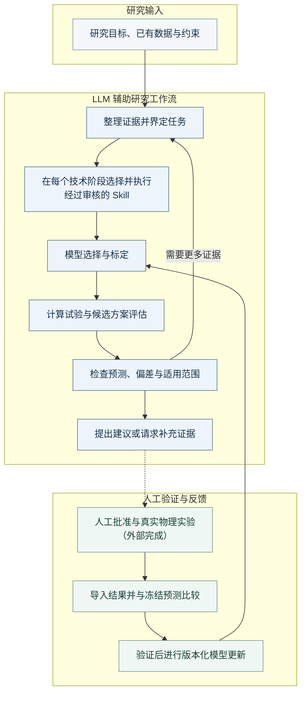

# Axiom Research

[English](README.md) · [简体中文](README.zh-CN.md)

**以可复用 Skill 连接科学证据、数值建模与实验反馈的模块化 LLM 辅助研究框架。**

从研究问题、已有数据和实际约束出发。具备文件与终端能力的 LLM 宿主整理证据、选择经过审核的 Skill，数值工具执行计算。研究者获得可追溯的分析与建议，再决定开展哪些实物实验、回传哪些结果。

这一工作流可服务于材料设计与工艺改进研究。“模块化”指接口和工作流可扩展；当前模型仍受各自材料、观测量与工艺条件的适用范围限制。

[研究流程](#研究流程) · [快速开始](START_HERE.md) · [文件包说明](PACKAGE_GUIDE.md) · [宿主指南](HOST_START.md) · [静态展示页](index.html)

## 研究流程

下图是总体研究工作流，**不代表每个模块都已自动跑通完整链路**。具体范围见下方[能力状态与边界](#能力状态与边界)。

<!-- workflow:zh-CN:start -->

<!-- workflow:zh-CN:end -->

[查看本地 SVG](docs/assets/research-workflow.zh-CN.svg) · [可编辑 Mermaid 源文件](docs/assets/research-workflow.zh-CN.mmd)

主控会在**每个技术阶段**选择适合的已审核 Skill，图中的选择节点并非“每轮只选一次”。数值结果来自经过检查的程序，制造与测试由研究者在框架外完成。数据或模型不足时，应补证据、补标定或停止，不能直接宣称“最优方案”。反馈更新须满足所选模块支持的验证规则。

## 能力分组

| 研究需要 | Skill 与工具 |
| --- | --- |
| 定义问题、整理证据 | 带原文位置的证据、假设与缺口：[证据 Skill](skills/hybrid-am-evidence/SKILL.md) |
| 标定模型 | 测量响应拟合与分组验证：[标定 Skill](skills/measured-response-calibration/SKILL.md) |
| 计算试验与候选分析 | 轻量[扩散计算](skills/diffusion-moments/SKILL.md)、[泡沫模型比较](skills/polymer-foam-model-refinement/SKILL.md)，以及受支持范围内的候选分析 |
| 偏差与原因分析 | 有证据关联的假设和区分检查：[原因分析 Skill](skills/hybrid-am-cause-analysis/SKILL.md) |
| 提出实验或补测建议 | 在已实现的 VPP–DIW 工作流中，按预算与约束进行[候选规划](skills/bounded-experiment-planning/SKILL.md)或[标定规划](skills/calibration-only-planning/SKILL.md) |
| 比较反馈、更新模型 | 在 VPP–DIW 运行时中进行[冻结预测比较](skills/descriptive-feedback/SKILL.md)，以及[版本化更新与新确认](skills/safe-model-update/SKILL.md) |

## 当前应用案例

| 案例 | 展示的已有能力 | 入口 |
| --- | --- | --- |
| VPP–DIW 线宽／扩散 | 分开的经验几何线宽与浓度 sigma 路径；模型标定、约束候选、实测反馈比较和受验证条件控制的模型更新 | [线宽夹具](examples/width-calibration-demo/README.md)、[sigma 夹具](examples/sigma-calibration-demo/README.md)、[工作流与运行记录](LEGACY_VPP_DIW.md) |
| 层级聚合物泡沫 | 两级轻量建模、标定、预声明修正，以及受支持范围内的有限敏感性分析 | [模块指南](skills/polymer-foam-model-refinement/SKILL.md)、[合成夹具](examples/foam-refinement-demo/README.md)、[研究模板](templates/foam-research/task.json) |

这些是已实现的应用案例，不代表全部可能研究用途。包内数值夹具属于合成软件演示。泡沫模块使用独立入口，VPP–DIW 多轮运行时不会自动套用于泡沫。

## 输入与输出

| 研究输入 | 可核查输出 |
| --- | --- |
| 问题、观测量、目标与约束 | 明确的任务范围、假设和补充数据请求 |
| 文献资料与原文位置 | 附带条件和可追溯引用的证据记录 |
| 测量、单位、样品身份与预声明的数据分区 | 标定诊断、数值分析与模型比较 |
| 参数范围、预算及外部实验反馈 | 模块支持的候选建议、冻结预测比较与版本化报告 |

具体文件和数值输出取决于所选模块。建议用于研究者审核，不是设备指令。

## 选择入口

- **看项目：**阅读本总览、[流程 SVG](docs/assets/research-workflow.zh-CN.svg)和[文件包目录说明](PACKAGE_GUIDE.md)。
- **运行本地工具：**按 [START_HERE.md](START_HERE.md) 选择任一应用案例；这些脚本不会自动连接 LLM。
- **使用 LLM 宿主：**阅读 [HOST_START.md](HOST_START.md) 和[主 Skill](SKILL.md)。宿主须具备文件与终端工具。

获取 **v1.1.3 文档版**：[完整 ZIP](https://github.com/yuerway983-create/axiom-research-skill/releases/download/v1.1.3/axiom-research-modeling-toolkit-v1.1.3.zip)、[发布页与校验文件](https://github.com/yuerway983-create/axiom-research-skill/releases/tag/v1.1.3)、[包内发布说明](docs/RELEASE_DRAFT.md)。此前的 [v1.1.2](https://github.com/yuerway983-create/axiom-research-skill/releases/tag/v1.1.2) 保留原版文档与下载。

## 能力状态与边界

| 领域 | 当前状态 | 实现依据 |
| --- | --- | --- |
| VPP–DIW 工作流 | 可执行数值工具、宿主逐步操作与受验证条件控制的多轮反馈；固定 demo 仍为确定性合成演示 | [运行时](scripts/agent_runtime.py)、[轮次工具](scripts/round_tools.py)、[演示](scripts/campaign_demo.py) |
| 泡沫建模 | 可执行的独立分析；未接入自动实验规划器，未验证完整工艺到性能预测链 | [数值入口](scripts/foam_model.py)、[模块工作流](skills/polymer-foam-model-refinement/references/workflow.md) |
| 原因分析 | 宿主读取后开展补充分析；规划器不会自动使用，正式运行时审计／报告也不会自动收录 | [接入约定](skills/hybrid-am-cause-analysis/references/integration.md) |
| Skill 与文献发现 | 本地 registry 登记已审核条目；实时文献或 GitHub 检索依赖已授权的宿主工具，接入前需要审核 | [登记表](registry/runtime-skills.json)、[宿主说明](HOST_START.md) |
| 更广泛科研用途 | 可扩展方向，需要匹配的数据、模型和适配器；不是已实现的任意材料设计 | [现有范围](SKILL.md) |

预测区间、贝叶斯优化、商业求解器集成和设备控制不是现成功能。合成 demo 不证明 LLM 自主科研、真实材料改善或优于普通建模。各模块的完整限制保留在链接的技术指南中。

## 来源、可复现性与许可

主 Skill 标识为 `axiom-research`，仓库名保持 `axiom-research-skill`。文件包 **1.1.3**与 VPP–DIW 运行时 **1.0.0**、原因分析 **0.2.0**、泡沫 **foam-0.1** 分别计版本；本次只修改文档与展示。

来源记录和方法资料保留在 [evidence/](evidence/) 与 [references/](references/)，泡沫专用出处见[模块来源登记](skills/polymer-foam-model-refinement/references/sources.md)。[测试](tests/)与[历史报告](reports/)记录软件核查，不代表普遍科学验证。[VERSION](VERSION) 和 [MANIFEST.json](MANIFEST.json) 用于标识和核验文件包；每份历史清单仅对应其原版本。

项目自有文件采用 [MIT 许可](LICENSE)。保留[第三方说明](THIRD_PARTY_NOTICES.md)及各组件的归属信息。
